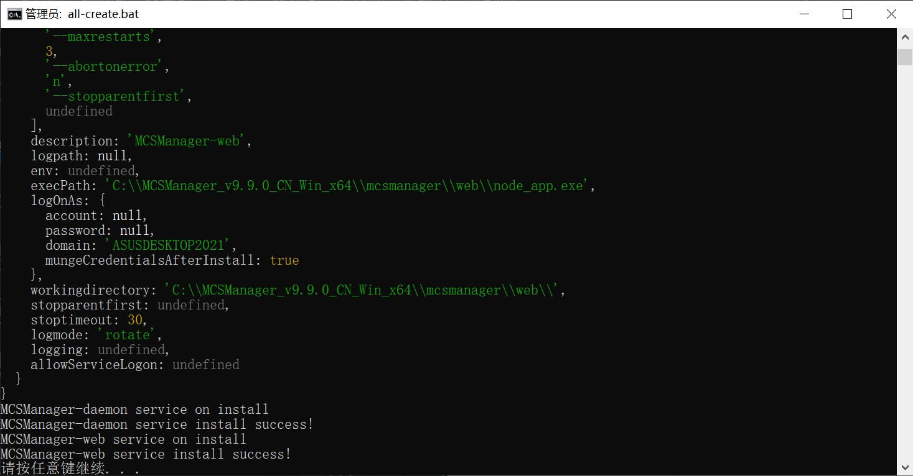

Language: zh_CN | [en](README/en.md)

# MCSManager Services for Windows
一款为了 Windows 能便捷地设置自启动 MCSManager 而生的工具。  

[使用 MIT 许可证。](https://mit-license.org/)  

已测试有效的操作系统：  
> Windows 10 专业版  
> Windows 10 LTSC 2019  

仓库：  
> Gitee: <https://gitee.com/bddjr/mcsmanager-services-for-windows>  
> Github: <https://github.com/bddjr/mcsmanager-services-for-windows>  
***
## 开始使用
### 1. 将 MCSManager 发行版下载并解压到C盘（解压到其它地方也不是不行）  

发行版地址  
> 境内： <https://gitee.com/mcsmanager/MCSManager/releases>  
> 境外： <https://github.com/MCSManager/MCSManager/releases>  

效果如下图
  

### 2. 将该仓库的所有源码下载为zip并解压  

下载地址  
> 境内： <https://gitee.com/bddjr/mcsmanager-services-for-windows/repository/archive/main.zip>  
> 境外： <https://github.com/bddjr/mcsmanager-services-for-windows/archive/refs/heads/main.zip>  

然后解压到包含`web`文件夹与`daemon`文件夹的位置，效果如下图  
  

### 3. 进入这个文件夹
  

***
## 创建服务
双击运行 `all-create.bat` ，成功完成后效果如下图。  
  

如果你想查找这些服务，可以按键盘上的 `win`+`R` ，输入 `services.msc` 然后按键盘上的 `Enter` 打开“服务”，找到 `MCSManager-` 开头的服务。  
  

***
## 立即启动服务
双击运行 `all-start.bat`  

***
## 立即停止服务
双击运行 `all-stop.bat`  

***
## 立即停止并删除服务
双击运行 `all-remove.bat`  

