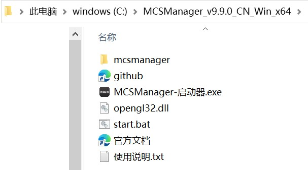
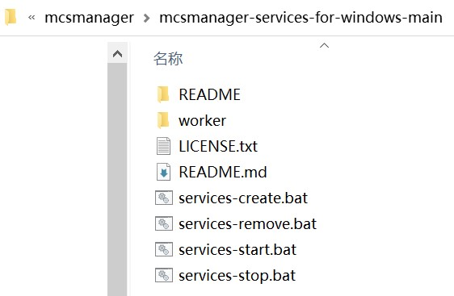

### Language:  
> [zh_CN](../README.md)  
> ***en***  

***
# MCSManager Services for Windows
A tool developed for Windows to easily set up self starting MCSManager.  

[Using MIT license.](https://mit-license.org/)  

Tested valid OS:  
> Windows 10 Pro (x64)  
> Windows 10 LTSC 2019 (x64)  

Github repertoty: <https://github.com/bddjr/mcsmanager-services-for-windows>  

***
## Get Start
### 1. Download and unzip the MCSManager release to the C drive (Decompression to another location is also possible)

Releases link: <https://github.com/MCSManager/MCSManager/releases>

The effect is shown in the following figure  

  

### 2. Download all the source code of the repertoty as zip and extract it

Download link: <https://github.com/bddjr/mcsmanager-services-for-windows/archive/refs/heads/main.zip>  

Then extract to the location containing the `web` folder and the `daemon` folder, as shown in the following image  

  

### 3. Enter this folder

  

***
## Create services
Double click to run `services-create.bat` . After successful completion, the effect is shown in the following figure.  

  

If you want to find these services, you can press `win`+`R` on the keyboard, enter `services.msc` , then press `Enter` on the keyboard, and then find the services starting with `MCSManager-` .  

  

***
## Start services
Double click to run `services-start.bat`  

***
## Stop services
Double click to run `services-stop.bat`  

***
## Stop and remove services
Double click to run `services-remove.bat`  

